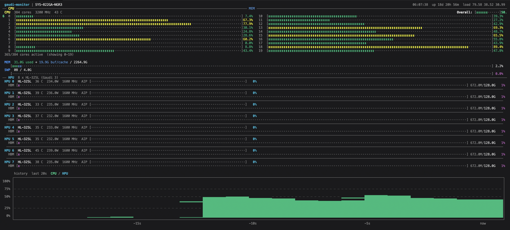

# gaudi-monitor

Inspired by [nv-monitor](https://github.com/wentbackward/nv-monitor) by Paul Gresham ([@wentbackward](https://github.com/wentbackward)).

Local monitoring TUI, CSV logger, and Prometheus/OpenMetrics exporter for Intel Gaudi AI Accelerator systems — all in a single <80KB binary with zero runtime dependencies. Built for servers running Intel Gaudi HPUs (Gaudi 1, Gaudi 2, Gaudi 3).

Accurately monitor a single machine or an entire cluster with minimal overhead. Reports metrics via HLML (Habana Labs Management Library), with correct handling of HBM memory. Includes `demo-load`, a zero-dependency synthetic CPU load generator for validating your monitoring pipeline end-to-end.

  



## Display

### CPU Section
- **Overall** aggregate usage bar across all cores
- **Per-core** usage bars in dual-column layout with ARM core type labels (if applicable)
- CPU temperature (highest thermal zone) and frequency

### Memory Section
- **Used** (green) — actual application memory (total - free - buffers - cached)
- **Buf/cache** (blue) — kernel buffers and page cache (reclaimable)
- Swap usage bar

### HPU Section
- **AIP utilization** bar with temperature and power draw (watts)
- **HBM** memory bar showing used/total HBM capacity
- **Clock** — AI Core (AIC) clock speed

### HPU Processes
- **PID** — process ID
- **USER** — process owner
- **CPU%** — per-process CPU usage (delta-based, per-core scale)
- **HPU MEM** — HPU HBM memory allocated by the process
- **COMMAND** — binary name with arguments
- **(other processes)** — summary row showing CPU usage from non-HPU processes

### History Chart
- Full-width rolling graph of CPU (green) and HPU (cyan) utilization over the last 20 samples using Unicode block elements (▁▂▃▄▅▆▇█)

### General
- Color-coded bars: green (normal), yellow (>60%), red (>90%)
- **CSV Logging** — log all stats to file with configurable interval
- **Headless Mode** — run without TUI for unattended data collection
- 1s default refresh, adjustable at runtime or via CLI
- HLML loaded dynamically at runtime — no hard dependency on Gaudi drivers
- Falls back to `/sys/class/habanalabs` device discovery if HLML is unavailable

## Building

Requires `gcc` and `libncurses-dev`:

```bash
sudo dnf install -y gcc ncurses-devel
make
```

## Usage

```bash
./gaudi-monitor                           # TUI only
./gaudi-monitor -l stats.csv              # TUI + log every 1s
./gaudi-monitor -l stats.csv -i 5000      # TUI + log every 5s
./gaudi-monitor -n -l stats.csv -i 500    # Headless, log every 500ms
./gaudi-monitor -r 2000                   # TUI refreshing every 2s
./gaudi-monitor -p 9101                   # TUI + Prometheus metrics on :9101
./gaudi-monitor -n -p 9101                # Headless Prometheus exporter
```

Or install system-wide:

```bash
sudo make install
```

### Command-line options

| Flag      | Description                                | Default |
|-----------|--------------------------------------------|---------|
| `-l FILE` | Log statistics to CSV file                 | off     |
| `-i MS`   | Log interval in milliseconds               | 1000    |
| `-n`      | Headless mode (no TUI, requires `-l`/`-p`) | off     |
| `-p PORT` | Expose Prometheus metrics on PORT          | off     |
| `-t TOKEN`| Require Bearer token for `/metrics`        | off     |
| `-r MS`   | UI refresh interval in milliseconds        | 1000    |
| `-v`      | Show version                               |         |
| `-h`      | Show help                                  |         |

### Interactive controls

| Key     | Action                              |
|---------|-------------------------------------|
| `q`/Esc | Quit                                |
| `s`     | Toggle sort (HPU memory / PID)      |
| `+`/`-` | Adjust refresh rate (250ms steps)   |

## Prometheus Metrics

Pass `-p PORT` to expose a Prometheus-compatible metrics endpoint:

```bash
./gaudi-monitor -p 9101              # TUI + metrics at http://localhost:9101/metrics
./gaudi-monitor -n -p 9101           # Pure headless exporter
curl -s localhost:9101/metrics        # Check it works
```

### Available metrics

| Metric | Type | Labels | Description |
|--------|------|--------|-------------|
| `gaudi_build_info` | gauge | `version` | gaudi-monitor version |
| `gaudi_uptime_seconds` | gauge | | System uptime |
| `gaudi_load_average` | gauge | `interval` | Load average (1m, 5m, 15m) |
| `gaudi_cpu_usage_percent` | gauge | `cpu`, `type` | Per-core CPU utilization |
| `gaudi_cpu_temperature_celsius` | gauge | | CPU temperature |
| `gaudi_cpu_frequency_mhz` | gauge | | CPU frequency |
| `gaudi_memory_total_bytes` | gauge | | Total system memory |
| `gaudi_memory_used_bytes` | gauge | | Application memory used |
| `gaudi_memory_bufcache_bytes` | gauge | | Buffer and cache memory |
| `gaudi_swap_total_bytes` | gauge | | Total swap |
| `gaudi_swap_used_bytes` | gauge | | Swap used |
| `gaudi_hpu_info` | gauge | `hpu`, `name` | HPU device name |
| `gaudi_hpu_utilization_percent` | gauge | `hpu` | HPU AI core utilization |
| `gaudi_hpu_temperature_celsius` | gauge | `hpu` | HPU die temperature |
| `gaudi_hpu_power_watts` | gauge | `hpu` | HPU power draw |
| `gaudi_hpu_clock_mhz` | gauge | `hpu`, `type` | HPU clock speed (aic, mme) |
| `gaudi_hpu_memory_total_bytes` | gauge | `hpu` | HPU HBM memory total |
| `gaudi_hpu_memory_used_bytes` | gauge | `hpu` | HPU HBM memory used |

### Prometheus scrape config

```yaml
scrape_configs:
  - job_name: 'gaudi-monitor'
    authorization:
      credentials: 'my-secret-token'
    static_configs:
      - targets: ['gaudi-server:9101']
```

### Security

The exporter supports optional Bearer token authentication:

```bash
./gaudi-monitor -p 9101 -t my-secret-token           # token via CLI flag
GAUDI_MONITOR_TOKEN=my-secret-token ./gaudi-monitor -p 9101  # token via env var (preferred)
```

The env var is preferred over `-t` since CLI arguments are visible in `ps` output.

## Synthetic Load Testing

A companion tool `demo-load` generates sinusoidal CPU loads for visual testing — no bulky benchmarking tools required. See [DEMO-LOAD.md](DEMO-LOAD.md) for details.

```bash
make demo-load
./demo-load             # CPU sinusoidal load on all cores
```

For HPU (Gaudi) load generation, use the Intel Gaudi benchmarks provided in the `habanalabs-qual` package or the [Gaudi Model References](https://github.com/HabanaAI/Model-References).

## Requirements

- Linux (reads from `/proc` and `/sys`)
- ncursesw (TUI mode)
- Intel Gaudi drivers with HLML (for HPU monitoring — CPU/memory work without it)
  - Install via [Intel Gaudi Software Suite](https://docs.habana.ai/en/latest/Installation_Guide/index.html)

### Platform support

| Platform | Status |
|----------|--------|
| Any Linux + Intel Gaudi HPU (x86_64) | Fully supported — CPU, memory, HPU, processes, Prometheus exporter |
| Linux without Gaudi HPU | CPU and memory monitoring only, HPU section shows "HLML not available" with sysfs fallback |

### HLML library paths searched

gaudi-monitor searches for `libhlml.so` in the following locations:

- `libhlml.so.1` (LD_LIBRARY_PATH / ldconfig)
- `/usr/lib/habanalabs/libhlml.so.1`
- `/usr/lib/x86_64-linux-gnu/libhlml.so.1`
- `/opt/habanalabs/qual/gaudi2/bin/libhlml.so`

## License

MIT
